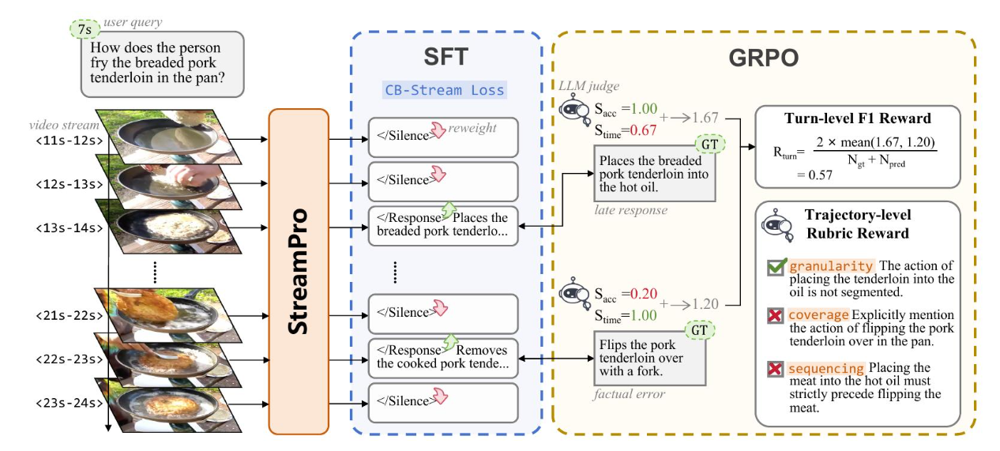
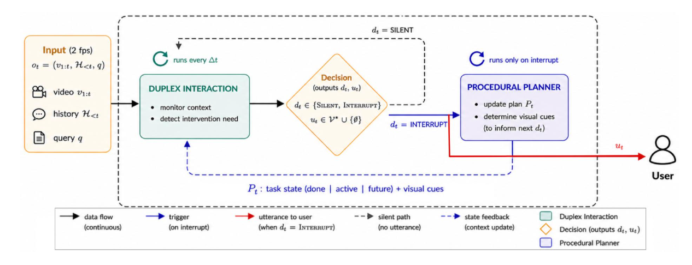
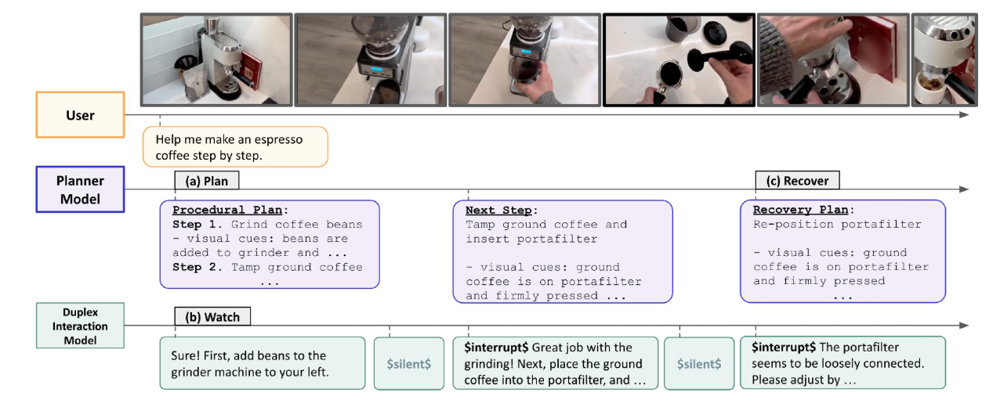
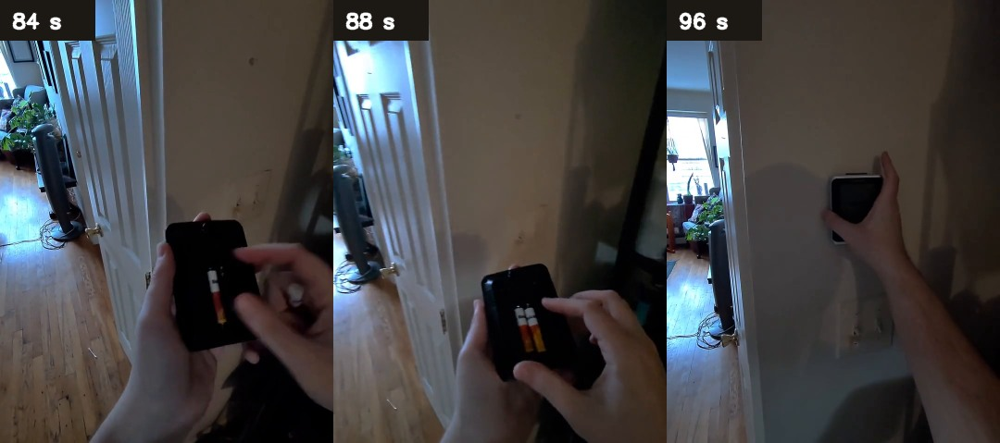

  <h1>EgoProactive Small：从主动视频文献到 PWR-inspired 决策系统</h1>
  
近期文献调研、路线选择、工程实现与阶段实验

  
阶段性工作汇报 · 2026-07-15

  
<strong>0.6341</strong>D1 五折 OOF Macro F1

  
<strong>+0.1711</strong>相对 R0 的 Macro F1 增量

  
<strong>9.15%</strong>shared-vision 端到端加速

**汇报主线：** 文献检索明确问题建模，PWR 提供程序状态框架；当前工作先建立可复现的小模型基线和稳定决策接口，再逐步验证状态、表示与训练策略。

<!-- SLIDE -->

## 1. 进阶文献检索：四条互补路线

  

    
<strong>MMDuet2</strong>
2025-12-07 · v1

    
多轮主动回答时机

    
文本式 <code>NO REPLY</code>，SFT 后用 PAUC-style GRPO 优化正确、尽早和少重复的回答。

  

  

    
<strong>StreamPro</strong>
2026-05-11 · v1

    
部分观测下的主动决策

    
CB-Stream Loss 处理 silence/response 不平衡，GRPO 同时使用 turn-level 与 trajectory-level reward。

  

  

    
<strong>R3-Streaming</strong>
2026-06-01 · v2

    
记忆、准备度与算力路由

    
Remember / Respond / Reason 三级控制；强调近期证据保真和按难度分配计算。

  

  

    
<strong>Plan, Watch, Recover</strong>
2026-06-03 · v1

    
操作步骤、偏离与恢复

    
显式 procedural state 与 planner–interaction duplex，与 EgoProactive 的任务语义最直接匹配。

  

<h3>比较口径</h3>
各论文的 benchmark、时序容差、文本评分和模型规模不同，论文分数不能与本项目 Macro F1 直接横向排序。这里比较的是问题建模和可迁移机制。

官方论文：<a href="https://arxiv.org/abs/2512.06810">MMDuet2</a> · <a href="https://arxiv.org/abs/2605.16381">StreamPro</a> · <a href="https://arxiv.org/abs/2605.17921">R3-Streaming</a> · <a href="https://arxiv.org/abs/2606.04970">PWR</a>

<!-- SLIDE -->

## 2. MMDuet2、StreamPro 与 R3：可借鉴机制

  

    <h3>MMDuet2：优化“何时回答”</h3>
    
<strong>数据与模型：</strong>52K videos，Qwen2.5-VL-3B。

    
<strong>训练：</strong>SFT 建立主动对话格式；GRPO 奖励回答正确且尽早，并惩罚重复、越界和冗长前缀。

    
<strong>本项目借鉴：</strong>及时性奖励和多轮轨迹约束。

    
<strong>不直接采用：</strong>3B 超过 Small 2B，任务更接近主动 VideoQA，缺少显式操作步骤状态。

  

  

    <h3>StreamPro：处理类不平衡与轨迹质量</h3>
    
<strong>模型：</strong>3B / 4B streaming VLM。

    
<strong>训练：</strong>CB-Stream Loss 提高稀疏 response token 权重；GRPO 同时评价单轮时机和整条响应轨迹。

    
<strong>本项目借鉴：</strong>类平衡监督和 trajectory-level objective。

    
<strong>不直接采用：</strong>训练预算高，benchmark 与 C1 的 chunk 二分类口径不同。

  

<h3>R3-Streaming 的直接启示</h3>
旧视觉记忆、是否准备好回答、是否调用慢模型是三个不同问题。当前不采用 fast/slow 双模型，但保留“近期证据高保真”和“readiness head 与自由回答解耦”两项设计。

**阶段判断：** 当前首先缺少稳定的 interrupt/silent 决策接口和可检验的过程状态，而不是直接启动大规模 GRPO。

<!-- SLIDE -->

## StreamPro：SFT 与 GRPO 训练流程

<!-- SLIDE -->

## 3. 赛道问题：模型不仅要回答，还要决定何时打断

  
<h3>当前可用输入</h3>第一人称视频截至当前 chunk、用户 query、当前时刻之前的官方 dialog、因果内部状态。

  
每个 chunk

  
<h3>唯一决策</h3><code>$silent$</code> 或 <code>$interrupt$&lt;utterance&gt;</code>

  
<h3>数据与指标</h3>
700 sessions，9,935 candidate chunks，四个领域。

Macro F1 同时平均 Interrupt F1 和 Silent F1，因此过度打断与过度沉默都会受罚。

  
<h3>部署边界</h3>
Small division 总参数不超过 2B。

推理只能读取当前及过去的信息；不能使用未来帧、未来 dialog、最终 session 长度或由未来信息派生的特征。

`dialog[i]` 是官方提供的、决策 `i` 之前已经发生的对话历史，不是模型自我反馈生成的闭环历史。`video_intervals[i]` 使用绝对时间 `[start, end]`。

<!-- SLIDE -->

## 4. PWR：把主动操作助手建模为“计划—观察—恢复”

  
<strong>Planner</strong> 初始化或更新 plan state

→

  
<strong>Watch</strong> 当前视频、历史与旧状态

→

  
<strong>Interaction</strong> silent / interrupt + utterance

→

  
<strong>Recover</strong> 偏离后重写步骤与 cues

  

    <h3>显式 procedural state</h3>
    
<code>goal</code> · <code>completed_steps</code> · <code>current_step</code> · <code>next_steps</code>

    
<code>step_complete_cues</code> · <code>step_incomplete_cues</code> · recovery plan

  

  

    <h3>状态解决的核心歧义</h3>
    
同一视觉动作在不同步骤可能需要不同提示；模型还要区分“正在做”“已经完成”“做错并需要恢复”。

    
interrupt 因而不是单帧事件检测，而是过程状态变化后的交互动作。

  

<h3>复现边界</h3>
截至正式审计，未找到官方 PWR training code、checkpoints、Pro²Bench train annotations、gold plan/cue targets 或完整对齐工程。当前实现是 PWR-inspired Small 路线，不是 official reproduction。

<!-- SLIDE -->

## PWR：Planner–Interaction 双模型闭环

<!-- SLIDE -->

## PWR：Plan、Watch、Recover 示例

<!-- SLIDE -->

## 5. 为什么选择 PWR-inspired Small 路线

| 选择标准 | PWR 提供的思路 | 本项目的 Small 适配 |
|---|---|---|
| 任务语义 | 第一人称操作指导，决定何时介入、如何恢复 | 与 C1 query、步骤和 interrupt 标签直接对应 |
| 关键变量 | current step、完成/未完成 cue、Out-of-Plan recovery | 构造紧凑 causal state，先测 oracle，再测 predicted/noisy state |
| 系统分工 | planner 与 interaction 解耦 | 状态更新器与二元 decision head 解耦，逐项消融 |
| 可证伪性 | oracle plan 可以测状态上限 | 状态无稳定增量时，暂停 planner 与粒度模型 |
| 参数约束 | 原论文依赖大型模型 | 保留 1.06B backbone，只增加轻量头或小型 adapter |

  
<h3>保留</h3>
过程状态、视觉完成证据、偏离恢复、内部状态与外部发言分离。

  
<h3>不照搬</h3>
两套大型在线模型、未公开监督、不可核查训练细节，以及当前尚无必要的 RL。

**实验原则：** 先回答冻结小模型中是否已有可恢复的决策信号，再回答显式状态能否带来可重复增量，最后决定 SFT、LoRA 或 GRPO。

<!-- SLIDE -->

## 6. 当前路线：每个阶段只回答一个问题

  
<strong>R0</strong>冻结无 plan 的因果零样本基线，建立完整复现证据链。完成

  
<strong>R0-F</strong>隔离自由生成的 tag 格式问题，不重跑模型。完成

  
<strong>R1</strong>4-session oracle compact-state 协议试验：null / step / cues / full。未过门槛

  
<strong>D1</strong>冻结 backbone，训练 session-held-out 标量、tag、hidden 融合决策头。已推广

  
<strong>D2</strong>测试 width-8 residual MLP，并完成 final-language-MLP LoRA 可行性审计。MLP 否决

  
<strong>复验</strong>在稳定 D1 接口上扩大、预注册 oracle state 试验。待执行

  
<strong>R2–R4</strong>粒度敏感性 → predicted state → noisy-plan robustness。条件触发

<h3>顺序约束</h3>
状态价值未证实时不建设 planner；粒度没有重复增量时不建设 granularity model；没有稳定监督基线和可测残差时不启动 GRPO。

<!-- SLIDE -->

## 7. 工程实现：固定 1.06B backbone，分离生成与决策

  

    <h3>模型与因果输入</h3>
    
<code>OpenGVLab/InternVL3_5-1B-HF</code>，固定 revision，1,060,897,792 base parameters，Apache-2.0。

    
当前 interval 提取 16 帧；累计视觉记忆均匀保留最多 32 帧；最多 4 个当前已可见 dialog turns。

    
BF16、SDPA、greedy decoding，输入帧调整为 448×448。

  

  

    <h3>模块职责</h3>
    
<code>proactive_r0</code>：帧提取、prompt、自由回答、分片与断点。

    
<code>proactive_r1</code>：oracle state schema 与受控 prompt 变体。

    
<code>proactive_d1</code>：特征缓存、五折头、在线 runner 与等价验证。

    
<code>proactive_d2</code>：非线性 residual 与 LoRA 表示适配审计。

  

  
<strong>R0 generation</strong> 生成 raw response / utterance

+

  
<strong>Fixed candidates</strong> <code>$silent$</code> / <code>$interrupt$</code>

→

  
<strong>D1 features</strong> scalar + margin + hidden

→

  
<strong>Decision head</strong> 阈值决定是否发言

金标 `answers` 在神经特征提取前物理删除；标签只在 OOF 头训练与评估阶段重新挂接。

<!-- SLIDE -->

## 8. D1 输入：三类互补的因果特征

  <strong>18 causal scalars</strong>
  
首 chunk、chunk index、当前结束时间、interval 时长、时间 gap、可见 dialog 比例、输入帧比例、4 个 domain one-hot，以及 R0/R0-F 决策与 raw response 格式属性。

  
18 维

  <strong>Fixed-tag margin</strong>
  
<code>log P($interrupt$ | prompt) − log P($silent$ | prompt)</code>。它保留连续排序信息，不依赖自由生成是否恰好输出合法 tag。

  
1 维

  <strong>Causal hidden</strong>
  
取候选标签开始前最后一个 prompt token 的最终层表示。两个候选路径逐 chunk 验证 prefix hidden 完全相同，避免把待比较标签泄漏进特征。

  
1,024 维

18 + 1 + 1,024 = 1,043 维输入　→　线性权重 1,043 + bias 1 = 1,044 参数

线性头只负责 interrupt/silent gate；预测为 interrupt 时，回答内容优先复用 R0-F utterance，否则使用固定 fallback。

<!-- SLIDE -->

## 9. 实验设计：五折 OOF、消融与推广门槛

  
<strong>3 folds</strong> 拟合标准化与线性权重

→

  
<strong>1 fold</strong> 只选择 threshold

→

  
<strong>1 untouched fold</strong> 冻结预测后评分

×5

  
<strong>Merged OOF</strong> 每个 session 测试一次

| 受控变体 | 输入 | 目的 |
|---|---:|---|
| tag only | 1 | 固定标签相对概率能否独立决策 |
| hidden linear | 1,024 | 冻结多模态表示是否线性可分 |
| scalar + tag | 19 | tag margin 对强标量控制的增量 |
| fused linear | 1,043 | scalar、margin 与 hidden 是否互补 |

**推广门槛：** 相对 D1 scalar 至少 `+0.005` Macro F1；paired-session bootstrap 下界为正；两类 F1 不坍缩；中段 chunk、fold 与 domain 的改善具有稳定性。

同一 session 的相邻 chunks 永不跨 train/test。全部五折仍来自公开 validation，因此结果标记为 `val-supervised`。

<!-- SLIDE -->

## 10. 实验结果：校准是主要增量，神经表示提供互补信号

| 实验 | Macro F1 | Interrupt F1 | Silent F1 | 结论 |
|---|---:|---:|---:|---|
| R0 | 0.4630 | 0.3728 | 0.5531 | 明显偏 silent；633 个 malformed |
| R0-F | 0.5362 | 0.4879 | 0.5845 | 格式修复有效，但属 val-supervised 规则 |
| D1 scalar | 0.6119 | 0.6366 | 0.5873 | 决策与标注策略校准是最大增量来源 |
| D1 fused | **0.6341** | 0.6352 | 0.6330 | 两类更平衡；相对 scalar +0.0222 |
| D1 单阈值模拟 | 0.6330 | 0.6298 | 0.6361 | 仅下降 0.00113，部署稳健性通过 |
| D2 width-8 MLP | 0.6351 | 0.6375 | 0.6327 | +0.0010，区间跨零，按门槛否决 |

  
<h3>稳定性</h3>
D1 fused 相对 scalar 的 paired-session bootstrap 95% interval 为 [+0.0123, +0.0322]；5/5 folds、4/4 domains 改善。

  
<h3>消融含义</h3>
tag only 0.5313，hidden only 0.6031，scalar + tag 0.6172。0.6341 不能表述成 hidden 单独带来的结果。

**证据边界：** 0.6341 是 public-validation-supervised 的 OOF 开发估计；全量重拟合 0.6719 只是 train-fit sanity，不用于泛化汇报。

<!-- SLIDE -->

## 11. 具体样本：电池极性错误与恢复过程

  

    
    
Session 143 · 84 s / 88 s / 96 s：取出设备、检查电池方向、重新装回墙面。

  

  

    

      
Task<strong>Replacing batteries in thermostat</strong>

      
时长<strong>140.9 s · 22 chunks</strong>

      
R0-F → D1<strong>修复 10 个 interrupt 漏报</strong>

      
金标恢复行为<strong>识别电池装反，翻转极性并重新插入</strong>

      
当前局限<strong>时机改善，但部分 utterance 仍为通用下一步提示</strong>

    

    <a class="web-link" href="http://127.0.0.1:8766/#samples" target="_blank">打开交互式视频时间轴</a>
  

网页同时展示视频、每个 chunk 的绝对时间、gold/prediction、TP/FP/TN/FN，以及 interrupt utterance。点击 chunk 后视频跳转到对应 interval 起点。

<!-- SLIDE -->

## 12. 等价加速、当前系统与下一步

| 推理方案 | 结果 | 等价性 | 决定 |
|---|---|---|---|
| batch-of-two | wall time +17.37%，显存 +19.59% | 特征与决策一致 | 否决：仍计算两份长序列与视觉输入 |
| cropped prefix cache | wall time +6.02%，margin 最大漂移 0.113382 | 不等价 | 否决：BF16/SDPA 计算形状产生漂移 |
| shared vision | 127 chunks：500.892 s → 455.056 s，显存不变 | hidden、margin、decision、answer 127/127 一致 | **推广：端到端加速 9.15%** |

  
<h3>当前系统</h3>
InternVL3.5-1B + 1,044 参数 D1 fused linear head。

部署使用 shared vision；sequential 永久保留为正确性参照。

  
<h3>下一阶段</h3>
先执行唯一冻结的 final-language-MLP LoRA 五折 OOF；若无增益，转向更大、预注册的 oracle-state 复验。

其后依次验证粒度、predicted state 和 noisy-plan robustness。

**阶段结论：** 已完成可复现 Small 基线、严格因果决策头、完整 OOF 评估和等价部署加速；PWR 的过程状态假设仍需在稳定 D1 接口上做更大规模验证。GRPO 只在状态收益、剩余误差和监督基线都稳定后进入。
